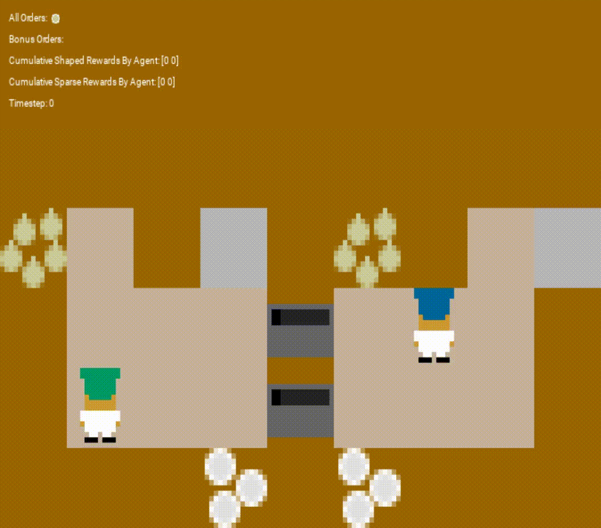
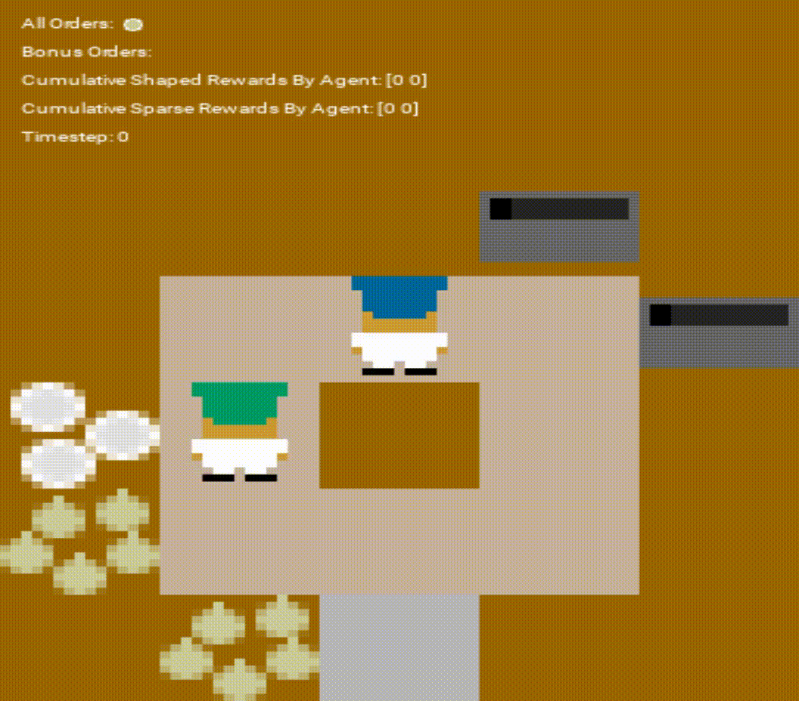
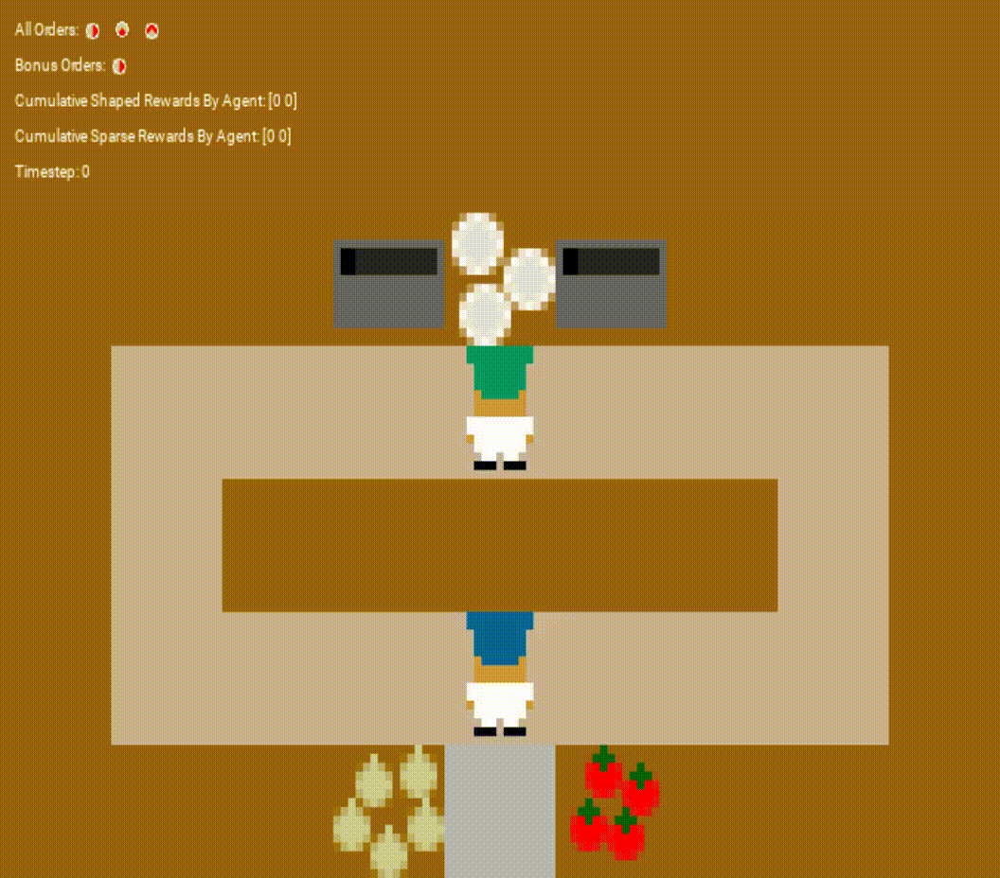
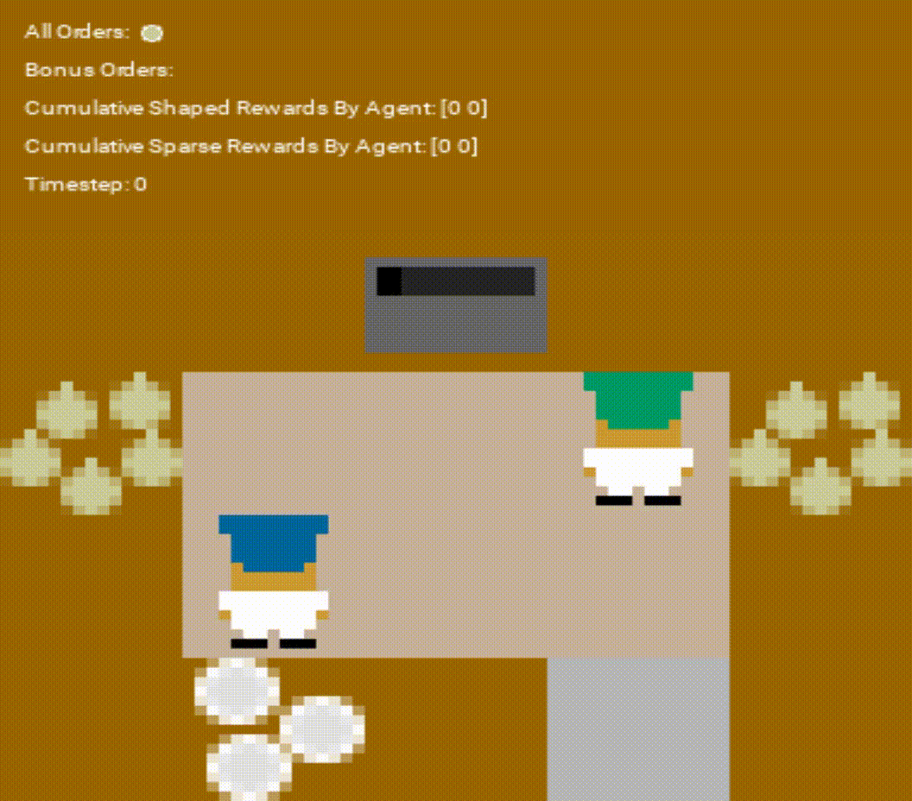
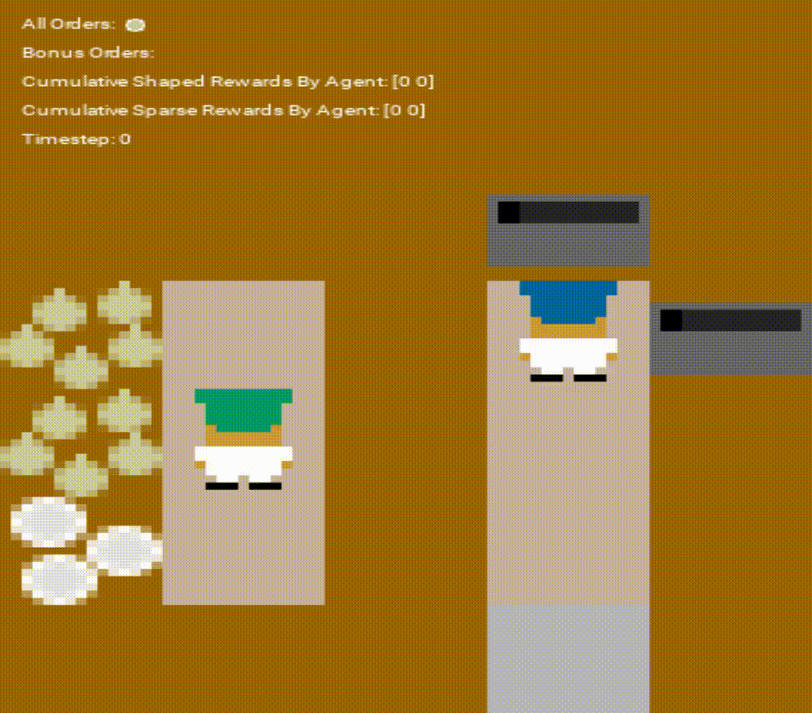

<h3 align="center">Learned Agents: Multi-layout Showcase</h3>

<table>
  <tr>
    <td colspan="2" width="33%">
      
       
      
<b>Asymmetric Advantages</b>

    </td>
    <td colspan="2" width="33%">
      
       
      
<b>Coordination Ring</b>

    </td>
    <td colspan="2" width="33%">
      
       
      
<b>Counter Circuit</b>

    </td>
  </tr>
  
  <tr>
    <td colspan="3" width="50%">
      
       
      
<b>Cramped Room</b>

    </td>
    <td colspan="3" width="50%">
      
       
      
<b>Forced Coordination</b>

    </td>
  </tr>
</table>

