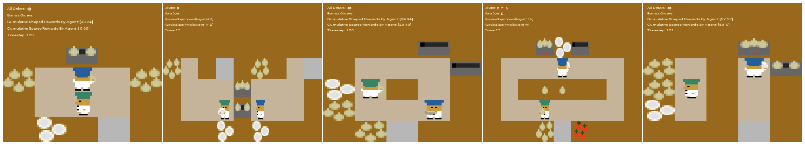
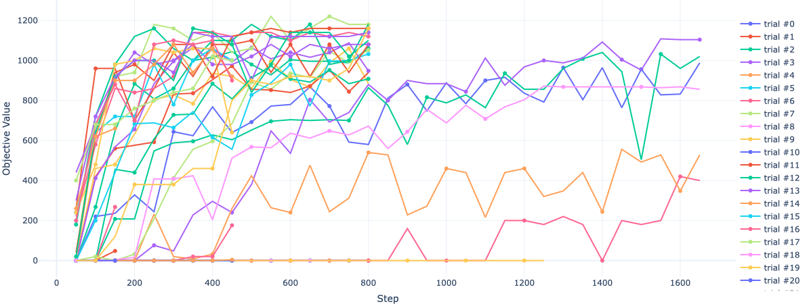

---
format:
    revealjs:
        theme: default
        css: styles.css
        navigation_mode: linear 
        embed-resources: true
        smaller: true
        lightbox: true
---

## Overcooked Project

::: {.columns}

::: {.column}

### Project Overview

* Implemented **PPO** and used **IPPO** for multi-agent reinforcement learning
    * Demonstrated competitive performance
* Focused on **generalization** on unseen layouts:
    * Trained agents on **5 training layouts**.
    {.lightbox}
    * Evaluated generalization on **2 unseen layouts**.
* Built using **Jax/Flax** to achieve high throughput of acting/learning steps
    * Enabled feasible runtimes for hyperparameter optimization
* Conducted **Optuna** hyperparameter search to identify the optimal PPO hyperparameters, state encoding and architecture

:::

::: {.column}

### Sparse reward is not enough

* Reward is given **only when a soup is delivered**
* Soup delivery requires an orchestration of intermediate steps
    * **Problem**: it is difficults for agents to understand which intermediate actions contribute to the final delivery
* **Solution**: Implemented a **gymnasium wrapper** that uses `info` dictionary to do **reward shaping**
    * "Babysits" the agents to incentivize actions that increase the probability of delivery
* Early reward hacking is transient
    * The agent pair eventually learns that delivering soups maximizes total reward.

:::

:::

::: {.notes}

* *The 37 Implementation Details of Proximal Policy Optimization*
* **Rewards**:
    * ingredient pickup $\to 3$
    * dish pickup $\to 3$
    * soup pickup $\to 5$
* **Reward shaping types**:
    * individual
    * shared 
* **Reward annealing**

:::

## State Representation & Architectures

::: {.columns}

::: {.column}
### Featurized Encoding

* **Hand-crafted features**
* Produces a **96-dimensional vector** (assumes 2 pots)
* Encodes:
    * Agent-centric features (position, direction)
    * Pot states
    * Relative distances to key entities
* **Problems**:
    * Spatial geometry and any information not captured by the hand-crafted features are discarded
    * Increasing the number of pots increases the feature dimension
* Processed via an **MLP**

:::

::: {.column}
### Lossless Encoding

* **Raw state**
* $H\times W\times C$ tensor:
    * $H, W$: spatial dimensions of the layout
    * $C$: each channel is a binary grid indicating presence/absence of an entity in a cell
* **Advantages**:
    * Preserves full spatial structure and state information
    * Layout-agnostic, supports variable entity numbers
* **Problem**: layouts may have different $H \times W$ 
    * **Solution**: zero-padding to the maximum size of all training layouts.
* Processed via **Nature-CNN-inspired architecture**
:::

:::

::: {.notes}
**Featurized**:

* What happens if we increase the number of onions to 100?
* Requires changing the network input size
* Works well in general, but limited when we want *generalization across layouts*

**Lossless**:

* Zero-padding is okay: it indicates the absence of all entities in those cells
* CNN:
    * Small $3\times 3$ kernels
    * No max-pooling or stride $=1$
    * Avoid squashing spatial information in small layouts
:::

## Experiments & Results

::: {.columns}

::: {.column width="45%"}

{.lightbox}

<table class="small-table">
  <thead>
    <tr><th>Layout</th><th>Avg. Score</th></tr>
  </thead>
  <tbody>
    <tr><td>Cramped Room</td><td>220</td></tr>
    <tr><td>Asymmetric Advantage</td><td>460</td></tr>
    <tr><td>Coordination Ring</td><td>260</td></tr>
    <tr><td>Forced Coordination</td><td>260</td></tr>
    <tr><td>Counter Circuit</td><td>-</td></tr>
    <tr><td>Cramped Tomato (Unseen)</td><td>315</td></tr>
    <tr><td>5x5 (Unseen)</td><td>-</td></tr>
  </tbody>
</table>

:::

::: {.column width="55%"}

### Conclusion 

* **Generalization emerges** when training on a diverse set of layouts
* **Featurized encoding** with *shared parameters* converges faster and obtain higher total reward¹
* **Fragility remains**:
    * Policies often "overfit" to specific training coordination patterns
    * Small layout changes can still break synchronization
* **Future work**:
    * Increase both the **variety** and **number** of training layouts through **procedural generation**

:::

::: {style="font-size:60%; opacity: 0.7; text-align: right"}
¹ **Total Reward**: Sum of cumulative rewards across all training layouts
:::

:::

::: {.notes}
* Policy learnt to deliver onions and doesn't know how to deliver tomatoes
:::

# Demo Time 🚀